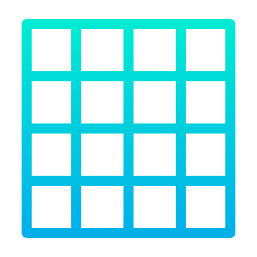

<div align="center">

  
  <h1>FDF</h1>
  
  <p>
    Transforming a grid of numbers into a 3D graphic wire mesh.
  </p>
</div>
  
  # :notebook_with_decorative_cover: Table of Contents

- [About the Project](#star2-about-the-project)
  * [Features](#dart-features)
- [Getting Started](#toolbox-getting-started)
  * [Installation](#gear-installation)
- [Usage](#eyes-usage)
- [Roadmap](#compass-roadmap)
- [Contact](#handshake-contact)


## :star2: About the Project
A project made in accordance with the FdF project for the Codam Core Curriculum.
An intro to working with graphics. With FdF you transform a grid of numbers into a 3D graphic wire mesh.
You use a graphics library to make a looping program to display a wire frame mesh. Which with the bonus can also move around, zoom and rotate.
I used [W2Wizard's](https://github.com/codam-coding-college/MLX42) remake of the MLX library.


### :dart: Features

- WASD: Movement
- QE: Zoom
- RT: X-axis rotation
- FG: Y-axis rotation
- VB: Z-axis rotation
- 0: Reset to initial


## 	:toolbox: Getting Started

### :gear: Installation

Start by cloning the repository into your projects includes filder:
```c
git clone https://github.com/BasUitermark/fdf_mlx42.git
```
Install [MLX42](https://github.com/codam-coding-college/MLX42)


## :eyes: Usage

Load in a .fdf file that contains the same number of digits per row as the rest of the rows. See [/maps](https://github.com/BasUitermark/fdf_mlx42/tree/master/maps) for examples.
Then using the following command:
```c
make run [map name]
```


## :compass: Roadmap

Nothing to do here.


## :handshake: Contact

See my profile page for ways to contact me!
